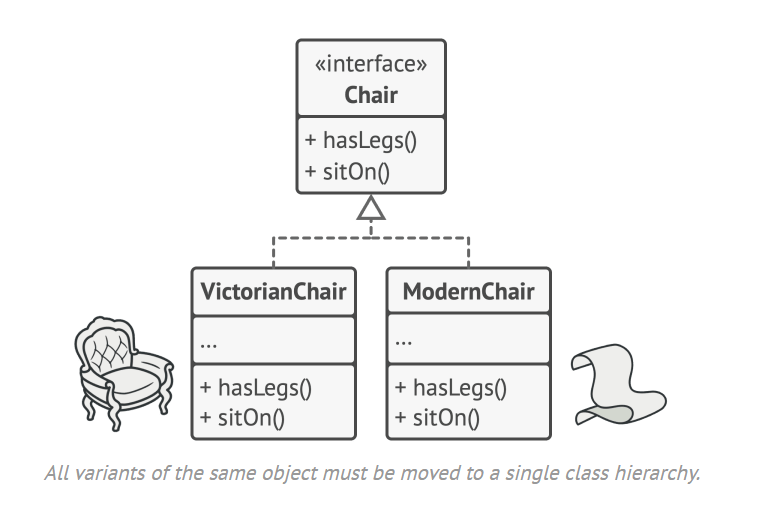

# Factory Method / Client Code

## Intent

Lets you produce families of related objects without specifying their concrete classes.

## Problem

You want a way to associate certain objects with each other so they match other objects of the same family.

## Solution

Explicitly declare interfaces for each product of the product family, then make all variants of products follow these interfaces.

