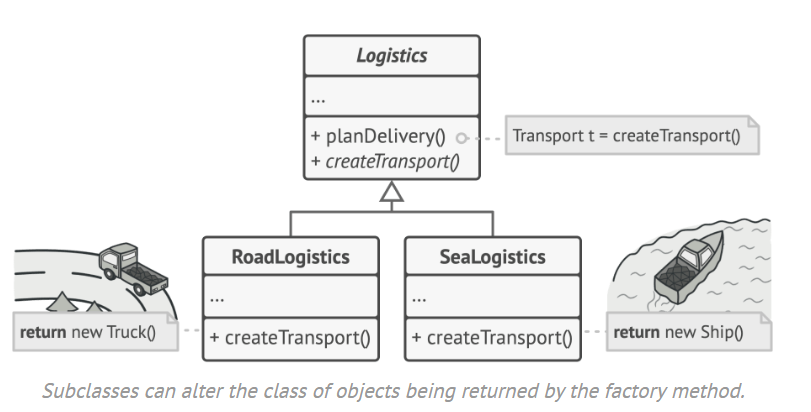

# Factory Method / Client Code




## Intent

Provides and interface for creating objects in a superclass but allows subclass to alter the type of object that will be created.

## Problem

When you have one class to do something, but then you need another class to carry out a similar purpose. (e.g. transportation done via trucks, now you want to do it by ships too)

## Solution

Create an overarching/parent class for the the two sub/child classes and use ```return new ClassName()``` when calling the method from the children.

Limitation: Children need to implement the same interface as the parent. Then each child can implement the method differently.

