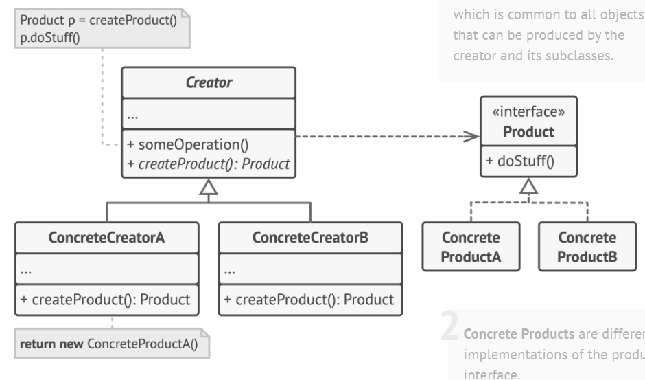

## Structure



**Product**: declares interface (common to all objects produced by its creator & subclasses).

**Concrete Products**: different implementations of the product interface.

**Creator**: declares the factory method that returns new product objects. 
- Return type of this object must match the **product**
- Can declare the factory method as ```abstract``` to force subclassess to implement own versions of the method. 
- Or it can return a default product type.

**Concrete Creators**: override the base factory method so it returns a different type of product.
- Doesn't always need to create new istances. Can return exdisting objects from a cache/object pool/other source.